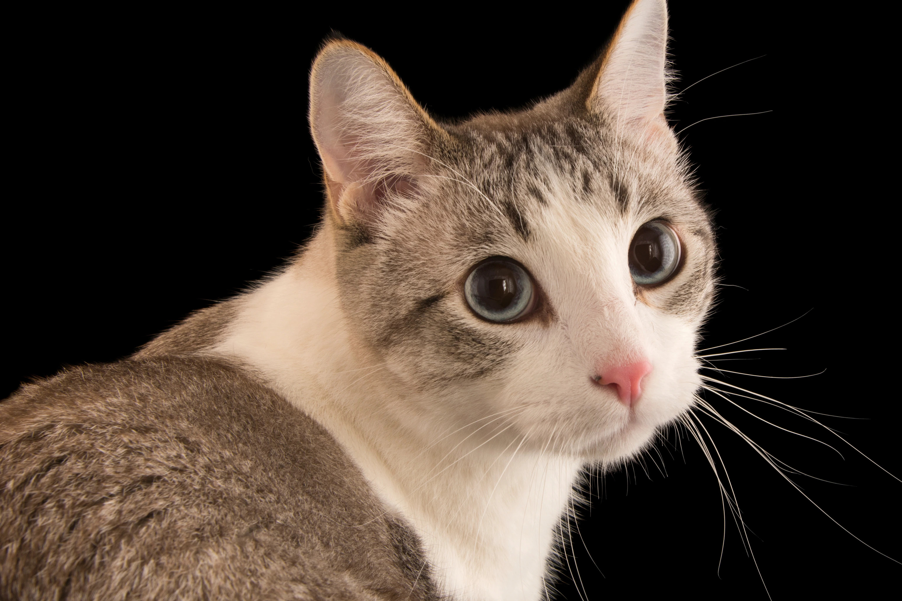

#  Narzędzia informatyczne 
##  Dlaczego nam się uda?
**Nasze 3 kroki do sukcesu**
 1. Chcemy stworzyć nowy, leprzy projekt
 2. Nie poddamy się, mimo trudności
 3. Mamy doświadczony zespół

*CO może nie wyjść?*
 - Brak jedzenia
 - Owocowe wtorki
 - Niska płaca

### Nasze miny podczas prezentacji
| Ja | Nie ja |
| :---: | :---: |
|||

### Kod z prezentacji
``` Lua
print("Witaj świecie!")
```
## Zdjęcie, bo miało być:



